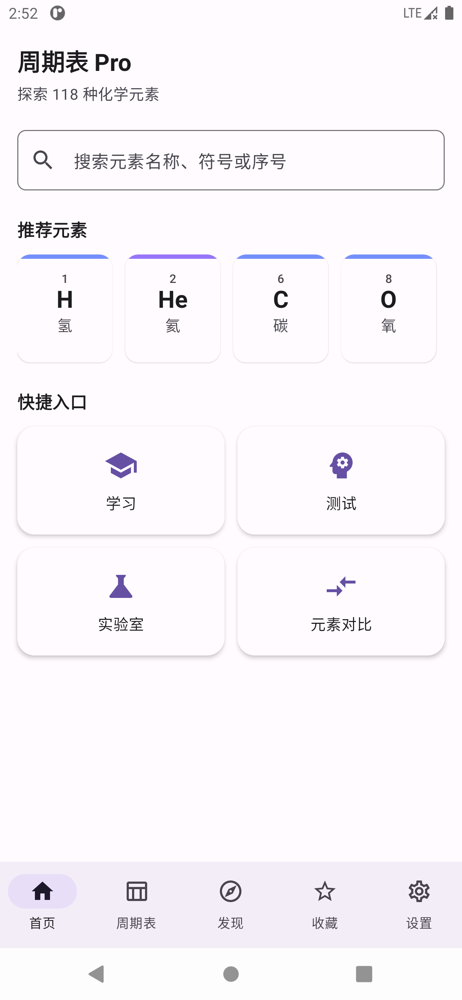
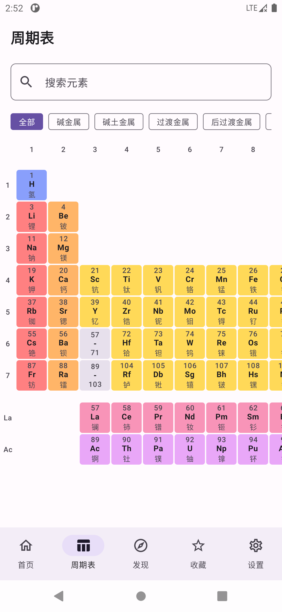
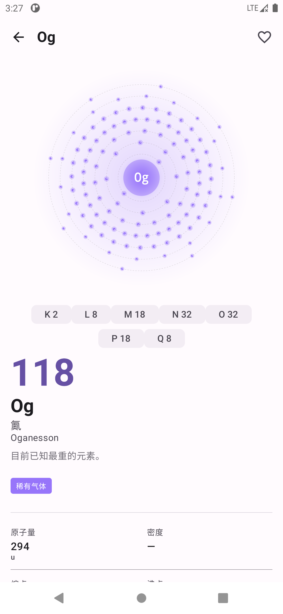
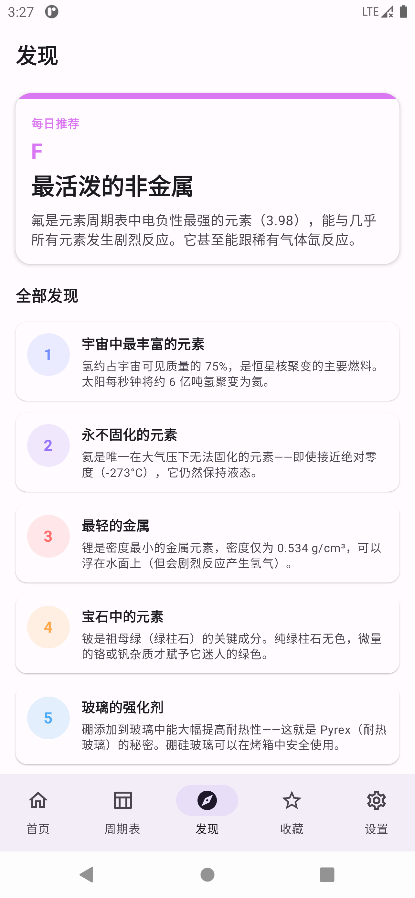
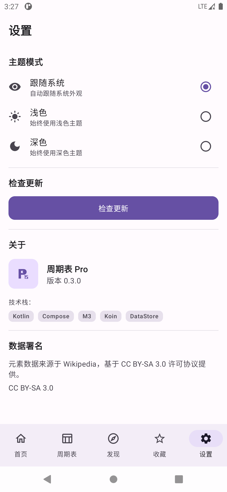
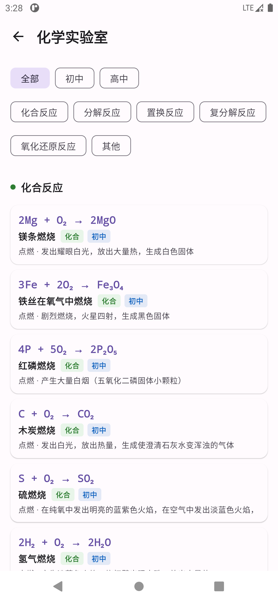
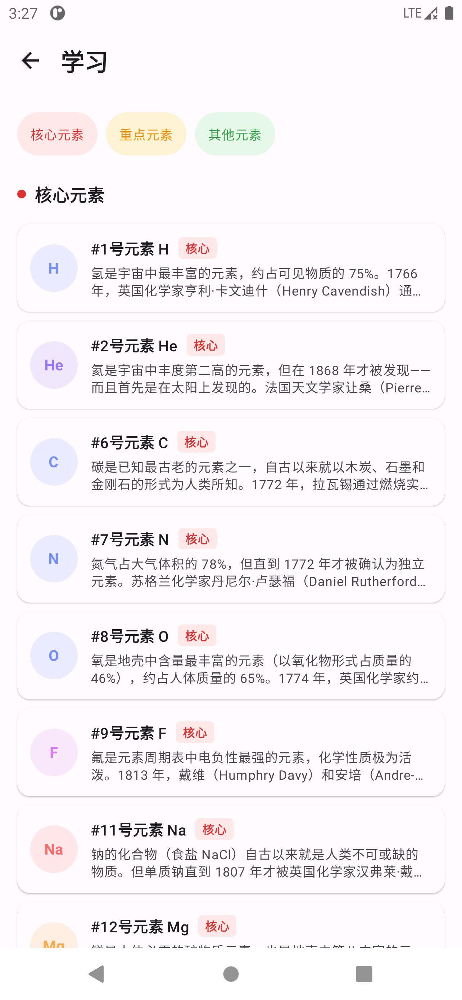

# 周期表 Pro (Periodic Pro) · v0.3.2

一款基于 Jetpack Compose 的交互式化学元素周期表 Android 应用。

## 功能

- **周期表**：标准 18x9 网格布局，横向滚动 + 分类筛选 + 长按多选
- **元素详情**：118 元素完整属性 + Canvas 2D 原子模型动画 + 电子壳层标注
- **元素对比**：多选元素横向属性对比表（二级全屏页面）
- **收藏**：DataStore 持久化，Swipe 左滑删除
- **搜索**：按名称/符号/序号/中文/拼音（含声调/无声调）模糊搜索
- **分类浏览**：10 种元素分类快捷筛选（碱金属/过渡金属/卤素等）
- **发现页**：分类/性质/晶体结构多维度探索
- **自适应**：手机(BottomBar)/折叠(NavRail)/平板(NavDrawer) 自动切换
- **深色/浅色主题**：一键切换
- **学习资料**：118 元素知识卡片 + 搜索 + 跳转详情
- **实验室**：化学反应库 + 实验详情 + 涉及元素跳转
- **元素知识测验**：4 种题型（符号/名称/分类/原子序数）+ 得分统计
- **自动更新**：GitHub Release 检测 + 应用内下载 + 进度对话框 + 安装

## 界面截图

| 首页 | 周期表 | 元素详情 |
|------|--------|----------|
|  |  |  |

| 发现页 | 设置 | 实验室 | 学习资料 |
|--------|------|--------|----------|
|  |  |  |  |

## 技术栈

| 类别 | 技术 |
|------|------|
| 语言 | Kotlin 2.0+ |
| UI | Jetpack Compose + Material 3 |
| 导航 | 双层 NavHost（root 全屏二级页面 + inner Tab）+ type-safe routes + NavigationSuiteScaffold |
| DI | Koin |
| 持久化 | DataStore Preferences |
| 手势 | 原生 Compose (horizontalScroll + combinedClickable) |
| 毛玻璃 | Haze |
| 测试 | JUnit4 + MockK + turbine |

## 运行

```bash
./gradlew assembleDebug
```

最低 Android 7.0 (API 24)，目标 Android 15 (API 35)。

## 目录结构

```
app/src/main/java/com/periodic/pro/
├── App.kt / MainActivity.kt      # 应用入口
├── theme/                         # 主题 (Color/Typography/Shapes/Dimensions)
├── data/                          # 数据层
│   ├── element/                   # 元素数据 (Repository + JSON 解析)
│   ├── favorites/                 # 收藏 (DataStore)
│   ├── update/                    # 自动更新 (UpdateService + ApkInstaller)
│   ├── discover/                  # 发现页数据
│   ├── lab/                       # 实验室数据 (反应库)
│   ├── learn/                     # 学习资料数据
│   ├── theme/                     # 主题偏好 (DataStore)
│   └── permission/                # 权限管理器
├── domain/                        # 领域层 (UseCase)
├── di/                            # Koin DI 模块
├── ui/
│   ├── components/                # 全局组件 (CategoryChip/PeriodicSearchBar/UpdateDialog/...)
│   ├── pattern/                   # 页面模式 (AtomCanvas/PropertyGrid/ElectronShells/...)
│   └── navigation/                # 导航 (Routes/PeriodicNav/PeriodicNavSuite)
├── feature/
│   ├── home/                      # 首页
│   ├── table/                     # 周期表
│   ├── detail/                    # 元素详情（二级全屏页面）
│   ├── compare/                   # 元素对比（二级全屏页面）
│   ├── favorites/                 # 收藏
│   ├── discover/                  # 发现
│   ├── category/                  # 分类浏览
│   ├── learn/                     # 学习资料（二级全屏页面）
│   ├── lab/                       # 实验室（二级全屏页面）
│   ├── quiz/                      # 元素知识测验（二级全屏页面）
│   └── profile/                   # 设置
└── assets/
    ├── elements.json              # 118 元素数据 (英文)
    └── elements_zh.json           # 中文名/拼音
```

## 数据来源

元素数据来自 [Bowserinator/Periodic-Table-JSON](https://github.com/Bowserinator/Periodic-Table-JSON)，基于 [CC BY-SA 3.0](https://creativecommons.org/licenses/by-sa/3.0/) 许可。

## CI/CD

GitHub Actions 自动化流水线：

| 触发 | 动作 |
|------|------|
| `push` / PR | 编译 debug + lint |
| tag `v*` | 编译 release + 签名 + GitHub Release |

### Release 签名配置

1. 生成 keystore：
```bash
keytool -genkey -v -keystore release.keystore -alias periodicpro \
  -keyalg RSA -keysize 2048 -validity 10000 \
  -storepass <你的密码> -keypass <你的密码> \
  -dname "CN=PeriodicPro, OU=Dev, O=PeriodicPro, L=Beijing, ST=Beijing, C=CN"
```

2. 在 GitHub 仓库 Settings → Secrets and variables → Actions 中添加以下 Secrets：

| Secret | 值 |
|--------|----|
| `KEYSTORE_BASE64` | `base64 -i release.keystore` 的输出 |
| `KEYSTORE_PASSWORD` | keystore 密码 |
| `KEY_ALIAS` | 密钥别名（如 `periodicpro`） |
| `KEY_PASSWORD` | 密钥密码 |

3. 推送 tag 触发发布：
```bash
git tag v0.3.2
git push origin v0.3.2
```

## 设计资产

`design/` 目录包含 4 张高保真设计图（Design System / Components / Patterns / Screens）和解析文档 `design/README.md`。

## License

元素数据：CC BY-SA 3.0

应用代码：MIT
